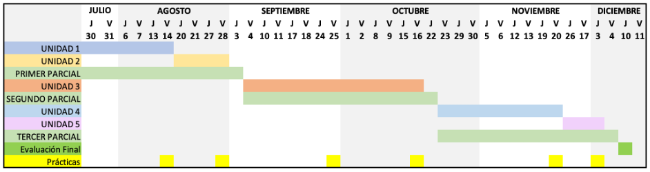

**PLAN DE ASIGNATURA**

**INF560 DESARROLLO WEB BACKEND**

**Marco referencial:** El programa docente del proceso enseñanza-aprendizaje está estructurado en correspondencia a los lineamientos del modelo académico; la asignatura responde al fortalecimiento de la familia laboral "Ingeniería de Software", así como también al perfil declarado en el proyecto curricular. La asignatura de "Desarrollo Web Backend" tiene como elementos de formación:

-   Desarrollo de soluciones web y servicios de software: Diseño e implementación de sitios web, aplicaciones web y API REST mediante tecnologías backend, aplicando estándares de calidad industrial que garanticen la funcionalidad, seguridad y mantenibilidad de los sistemas desarrollados.

**I. IDENTIFICACIÓN DE LA ASIGNATURA**

| Campo | Detalle |
|-------|---------|
| **Facultad** | Ciencias Puras |
| **Carrera** | Ingeniería Informática |
| **Asignatura** | Desarrollo web backend |
| **Sigla y código** | INF 560 |
| **Pre-requisito** | INF 460 |
| **Total horas** | 6 horas |
| **Trabajo independiente semana** | 6 horas |
| **Número de créditos** | 6 |
| **Horas teóricas** | 0 |
| **Horas prácticas** | 0 |
| **Horas laboratorio** | 6 |
| **Semestre** | Quinto Semestre |
| **Docente** | M. Sc. Huáscar Fedor Gonzales Guzmán |
| **Email** | huascar.fedor@gmail.com |

**II. FUNDAMENTACIÓN Y JUSTIFICACION**

El desarrollo web backend constituye uno de los pilares fundamentales en la formación del ingeniero informático, ya que abarca el conjunto de tecnologías, arquitecturas y procesos que operan en el servidor y sostienen el funcionamiento de cualquier aplicación o sistema web moderno. A diferencia de las interfaces visuales, el backend representa la lógica de negocio, la gestión de datos, la seguridad y la comunicación entre sistemas, elementos sin los cuales ninguna solución digital podría operar de manera robusta y escalable.

La asignatura de "Desarrollo Web Backend" introduce al estudiante en el diseño e implementación de aplicaciones del lado del servidor, la construcción de API REST como mecanismo estándar de integración entre sistemas, el manejo de bases de datos, la autenticación y autorización de usuarios, así como las buenas prácticas de desarrollo que rigen la industria del software a nivel global.

Su inclusión en el currículo de la carrera de Ingeniería Informática responde a la creciente demanda del mercado laboral por profesionales capaces de construir sistemas web completos, seguros y de alto rendimiento. El dominio de las tecnologías backend permite al egresado participar activamente en proyectos de desarrollo de software, tanto en entornos empresariales como en iniciativas de emprendimiento tecnológico, dotándolo de competencias directamente aplicables desde los primeros años de su vida profesional.

**III. PROPÓSITO**

La asignatura de "Desarrollo Web Backend" tiene como propósito formar en el estudiante las competencias técnicas y metodológicas necesarias para diseñar, desarrollar e implementar soluciones de software del lado del servidor, mediante el uso de tecnologías backend actuales y bajo estándares de calidad reconocidos por la industria. A través de un enfoque práctico y orientado a proyectos reales, el estudiante adquirirá la capacidad de construir aplicaciones web robustas, API REST funcionales y sistemas escalables, integrando principios de seguridad, gestión de bases de datos y arquitecturas de software que respondan a las exigencias del entorno profesional contemporáneo.

**IV. COMPETENCIAS DE LA ASIGNATURA**

**4.1. Competencia global de la asignatura.**

Desarrolla sitios web, aplicaciones web y API REST mediante el uso de tecnologías backend modernas, aplicando principios de arquitectura de software, seguridad, gestión de datos y buenas prácticas de la industria, con el fin de construir soluciones digitales funcionales, escalables y de calidad que respondan a necesidades reales del entorno profesional.

**4.2. Competencias específicas de la asignatura.**

Al finalizar la asignatura, el estudiante será capaz de:

-   Comprende los fundamentos del desarrollo web identificando el rol del backend dentro de la arquitectura de aplicaciones, diferenciando modelos arquitectónicos y el funcionamiento del protocolo HTTP como base para el desarrollo de soluciones del lado del servidor.

-   Aplica las tecnologías base del desarrollo web, integrando HTML5, CSS3 y JavaScript con lenguajes del lado del servidor para comprender el ecosistema completo de una aplicación web y seleccionar las tecnologías backend más adecuadas según el contexto del proyecto.

-   Desarrolla aplicaciones web funcionales del lado del servidor utilizando Laravel y Node.js/Express bajo el patrón MVC, integrando lógica de negocio, motor de plantillas, base de datos mediante ORM y buenas prácticas de configuración, para construir soluciones completas, mantenibles y de calidad.

-   Diseña e implementa API REST y servicios web aplicando estándares de seguridad mediante mecanismos de autenticación y autorización, garantizando la interoperabilidad entre sistemas y la correcta documentación bajo buenas prácticas de la industria.

-   Despliega aplicaciones web en entornos de producción utilizando tecnologías de alojamiento tradicional y en la nube, configurando arquitecturas escalables y tolerantes a fallos que garanticen la disponibilidad y el rendimiento del sistema.

**V. DESARROLLO DE SABERES DE LA ASIGNATURA**

| Saber conocer | Saber hacer | Saber ser |
|---------------|-------------|-----------|
| • Conceptos fundamentales del desarrollo web y el rol del backend en una aplicación • Diferencias entre arquitecturas monolíticas y de microservicios • Funcionamiento del protocolo HTTP: métodos, cabeceras y códigos de estado • Tecnologías, lenguajes y frameworks del desarrollo del lado del servidor • Estructura y funcionamiento del patrón de diseño MVC • Principios de programación del lado del servidor: ciclo de vida de solicitudes, sesiones y cookies • Conceptos de ORM, migraciones y relaciones entre modelos • Fundamentos de API REST: recursos, endpoints, métodos y códigos de estado • Mecanismos de autenticación y autorización: JWT y OAuth2 • Modalidades de alojamiento web: tradicional, en la nube y contenedores • Principios de arquitecturas escalables y tolerantes a fallos | • Configurar entornos de desarrollo backend utilizando frameworks como Laravel y Node.js/Express • Implementar aplicaciones web funcionales bajo el patrón MVC integrando vistas, lógica de negocio y base de datos • Desarrollar operaciones CRUD completas con validación y manejo de errores • Gestionar sesiones, cookies y autenticación básica en aplicaciones web • Diseñar e implementar API REST aplicando buenas prácticas y estándares de la industria • Aplicar mecanismos de autenticación y autorización mediante JWT y OAuth2 • Documentar API utilizando herramientas como Swagger / OpenAPI • Desplegar aplicaciones web en entornos de producción utilizando servicios en la nube y contenedores • Configurar arquitecturas escalables y tolerantes a fallos en entornos de producción | • Responsabilidad y compromiso en la entrega de soluciones de software funcionales y de calidad • Pensamiento crítico para analizar, seleccionar y justificar tecnologías backend según el contexto del proyecto • Disposición para el aprendizaje continuo ante la constante evolución de las tecnologías web • Atención al detalle en la escritura de código limpio, organizado y mantenible • Trabajo colaborativo y comunicación efectiva en entornos de desarrollo de software • Ética profesional en el manejo de datos, seguridad y privacidad de los usuarios • Autonomía e iniciativa para resolver problemas técnicos de manera creativa y eficiente • Adaptabilidad ante nuevos frameworks, herramientas y metodologías de desarrollo |

**VI. CONTENIDOS TEMÁTICOS DE LA ASIGNATURA**

**UNIDAD 1: Fundamentos del Desarrollo Web**

1.1 Conceptos generales del desarrollo web

1.2 Diferencias entre Front End y Back End

1.3 Rol e importancia del Backend en una aplicación web

1.4 Protocolo HTTP

1.4.1 Métodos HTTP

1.4.2 Cabeceras HTTP

1.4.3 Códigos de estado

1.5 Arquitecturas de aplicaciones web

1.5.1 Arquitectura monolítica y patrón MVC

1.5.2 Arquitectura de microservicios

1.5.3 Comparativa y criterios de selección

**UNIDAD 2: Tecnologías Base para el Desarrollo Web**

2.1 Introducción a HTML5

2.1.1 Estructura semántica y elementos principales

2.1.2 Formularios y validación

2.2 CSS3

2.2.1 Selectores y propiedades

2.2.2 Layouts: Flexbox y Grid

2.2.3 Diseño responsivo

2.3 JavaScript

2.3.1 Sintaxis y estructuras de control

2.3.2 Manipulación del DOM

2.3.3 Eventos e interactividad

2.4 Visión general de tecnologías y frameworks Backend

2.4.1 PHP y Laravel

2.4.2 Node.js y Express

2.4.3 Python y Django

2.4.4 Criterios de selección de tecnología

2.5 Lenguajes de programación del lado del servidor

2.5.1 Características y casos de uso de cada lenguaje

2.5.2 Comparativa entre lenguajes backend

**UNIDAD 3: Programación y Desarrollo de Aplicaciones Web con Frameworks Backend**

3.1 Servidores web

3.1.1 Funcionamiento de un servidor web

3.1.2 Configuración básica

3.2 Ciclo de vida de una solicitud web

3.3 Variables de entorno y configuración del proyecto

3.3.1 Archivos de configuración (.env)

3.3.2 Gestión de entornos: desarrollo, pruebas y producción

3.4 Frameworks MVC backend

3.4.1 Introducción al patrón MVC

3.4.2 Laravel: estructura y configuración de un proyecto

3.4.3 Node.js con Express: estructura y configuración de un proyecto

3.4.4 Enrutamiento y controladores

3.5 Lógica de negocio y manejo de sesiones

3.5.1 Variables de sesión

3.5.2 Cookies y autenticación básica

3.6 Motor de plantillas

3.6.1 Blade (Laravel): renderizado de vistas desde el servidor

3.6.2 EJS / Handlebars (Node.js): uso de plantillas dinámicas

3.7 Integración con bases de datos

3.7.1 Conexión de la aplicación a la base de datos

3.7.2 ORM: concepto y ventajas

3.7.3 Eloquent ORM (Laravel) y Sequelize (Node.js)

3.7.4 Migraciones y seeders

3.7.5 Relaciones entre modelos

3.8 Patrones de diseño aplicados al backend

3.8.1 Patrón Repository

3.8.2 Service Layer

3.9 CRUD completo

3.9.1 Integración de vistas, lógica y base de datos

3.9.2 Validación y manejo de errores

3.9.3 Logging y depuración de aplicaciones

**UNIDAD 4: Desarrollo de API y Servicios Web**

4.1 Fundamentos de API REST

4.1.1 Métodos HTTP aplicados a REST

4.1.2 Recursos y endpoints

4.1.3 Códigos de estado en API REST

4.2 Diseño de API RESTful

4.2.1 Mejores prácticas y convenciones

4.2.2 Versionado de API

4.2.3 Manejo de errores y respuestas estandarizadas

4.3 Introducción a GraphQL

4.3.1 Conceptos básicos

4.3.2 Diferencias con REST

4.4 Autenticación y autorización en API

4.4.1 JSON Web Tokens (JWT)

4.4.2 OAuth2

4.5 Documentación de API

4.5.1 Herramientas de documentación: Swagger / OpenAPI

**UNIDAD 5: Despliegue a Producción**

5.1 Introducción al despliegue de aplicaciones web

5.2 Alojamiento tradicional

5.2.1 Servidores dedicados

5.2.2 Servidores compartidos y VPS

5.3 Alojamiento en la nube

5.3.1 Principales plataformas: AWS, Google Cloud, Azure

5.3.2 Servicios PaaS e IaaS

5.4 Contenedores y virtualización

5.4.1 Introducción a Docker

5.4.2 Contenedores vs. máquinas virtuales

5.5 Arquitecturas escalables y de alta disponibilidad

5.5.1 Escalabilidad horizontal y vertical

5.5.2 Balanceo de carga

5.5.3 Tolerancia a fallos

**VII. MÉTODOS Y ESTRATEGIAS DE ENSEÑANZA APRENDIZAJE**

Se utiliza métodos y estrategias de enseñanza y aprendizaje de acuerdo con el avance de la ciencia y la tecnología educativa y necesidades de desarrollo de habilidades y destrezas.

-   Explicativo ilustrativo

-   Aprendizaje participativo

-   Método problémico

-   Método expositivo

-   Simulación de casos

-   Método investigativo

-   Lluvia de ideas

-   Aprendizaje por Proyectos

**RECURSOS:**

-   Computadora

-   Data display

-   Pizarra

-   Guías de laboratorio

-   Internet

-   Plataforma de aprendizaje en línea, oficial de la UATF

-   Herramienta de comunicación virtual Sincrónica (meet)

**RECURSOS DE LABORATORIO**

-   Composer, PHP, PostgreSQL, VS Code, Postman Y GitHub.

**VIII. SISTEMA DE EVALUACIÓN**

Las asignaturas de laboratorio se evalúan de la siguiente manera:

EXÁMENES PARCIALES: 30%

PRÁCTICAS: 10%

LABORATORIO: 30%

EXÁMEN FINAL: 30%

TOTAL: 100%

| Tipo de evaluación | Técnica | Instrumento | Evidencia | Entorno |
|--------------------|---------|-------------|-----------|---------|
| **Diagnóstica** | Interrogatorio (presencial y/o virtual) | Guía de observación (presencial y/o virtual) | Cuestionario resuelto (presencial y/o virtual) | Aula (presencial y/o virtual) |
| **Formativa** | Desempeño (presencial y/o virtual) | Prueba de laboratorio (presencial y/o virtual) | Presentación, exposición (presencial y/o virtual) | Aula (presencial y/o virtual) |
| **Sumativa / Producto** | Enunciado, ejercicios (presencial y/o virtual) | Prueba de laboratorio (presencial y/o virtual) | Presentación de trabajo final (presencial y/o virtual) | Aula (presencial y/o virtual) |

**IX. BIBLIOGRAFÍA**

Nixon, R. (2021). Learning PHP, MySQL & JavaScript: A Step-by-Step Guide to Creating Dynamic Websites (6a ed.). O'Reilly Media.

Duckett, J. (2014). HTML y CSS: Diseña y construye sitios web. Anaya Multimedia.

Duckett, J. (2015). JavaScript y JQuery: Desarrollo de interfaces web interactivas. Anaya Multimedia.

Stauffer, M. (2023). Laravel: Up and Running (3a ed.). O'Reilly Media.

Subramanian, V. (2019). Pro MERN Stack: Full Stack Web App Development with Mongo, Express, React, and Node (2a ed.). Apress.

Fielding, R. T. (2000). Architectural Styles and the Design of Network-based Software Architectures. Universidad de California, Irvine. (Tesis doctoral --- origen formal de REST)

Fowler, M. (2002). Patterns of Enterprise Application Architecture. Addison-Wesley Professional.

Martin, R. C. (2012). Código Limpio: Manual de desarrollo ágil de software. Anaya Multimedia.

Burns, B., Beda, J., & Hightower, K. (2019). Kubernetes: Up and Running (2a ed.). O'Reilly Media.

**X. CRONOGRAMA**

